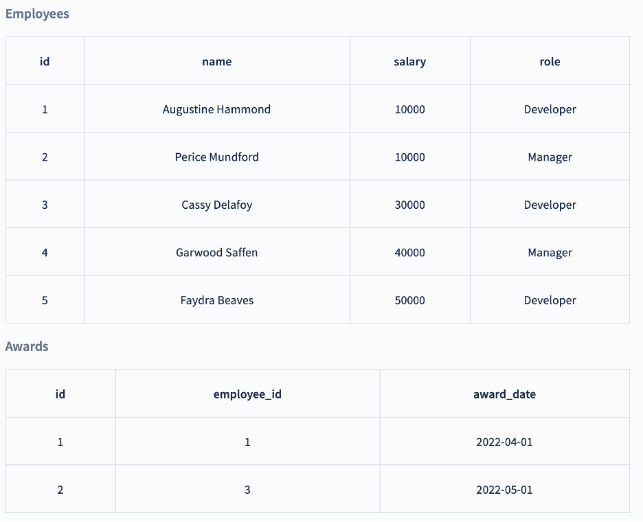
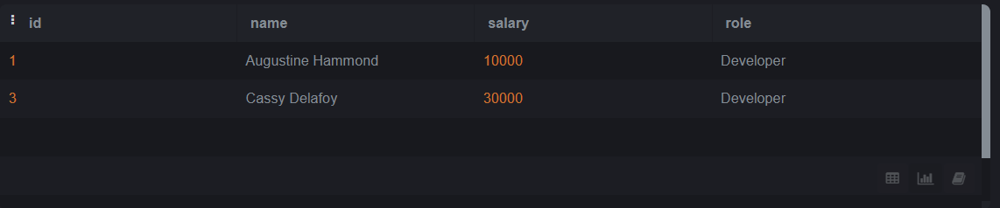
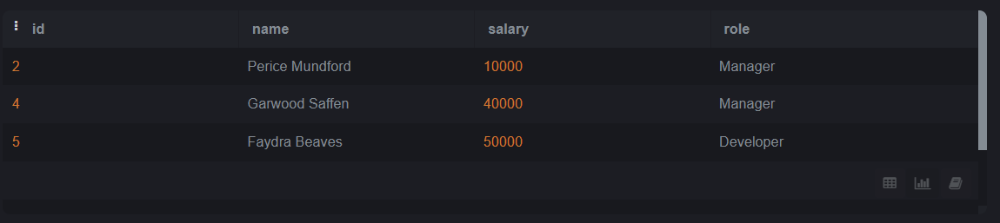
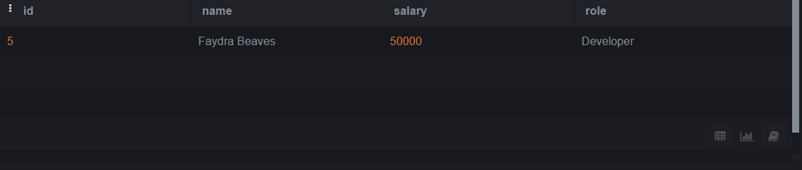
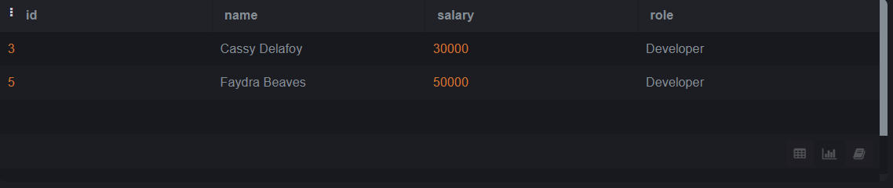
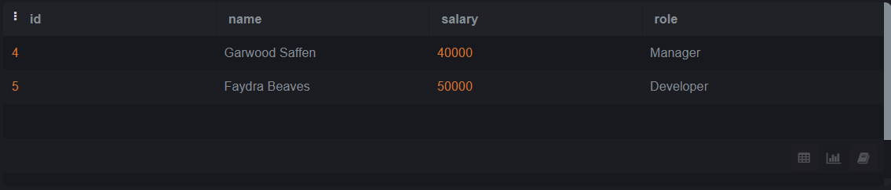

# SQL-Lab2

# We will use the Employees and Awards table below:

 

### Q1: Choose all employees who have received an award (Nested Query)?
Query:
```sql
select  * from employee where employee.id in (select awards.employee_id from awards)
```

Output:
 
 

### Q2: Choose all employees who have never received an award (Nested Query)?
Query:
```sql
select  * from employee where
employee.role="Developer" AND employee.salary > (SELECT sum(employee.salary) from employee where employee.role="Manager")
```

Output:
 

 
### Q3: Choose all Developers who make more than all Managers combined (Nested Query)?
Query:
```sql
select  * from employee where
employee.role="Developer" AND employee.salary > (SELECT max(employee.salary) from employee where employee.role="Manager")
```

Output:
 

 
### Q4: Choose all Developers who make more money than any Manager (Nested Query)?
Query:
```sql
select  * from employee where
employee.role="Developer" AND employee.salary > (SELECT employee.salary from employee where employee.role="Manager")
```
Output:

  

### Q5: Choose all employees whose salaries are higher than the average for their position. (Nested Query)?
Query:
```sql
select  * from employee where (
employee.role="Developer" AND employee.salary > (SELECT avg(employee.salary) from employee where employee.role="Developer"))
OR
employee.role="Manager" AND employee.salary > (SELECT avg(employee.salary) from employee where employee.role="Manager")
```

Output:
 
